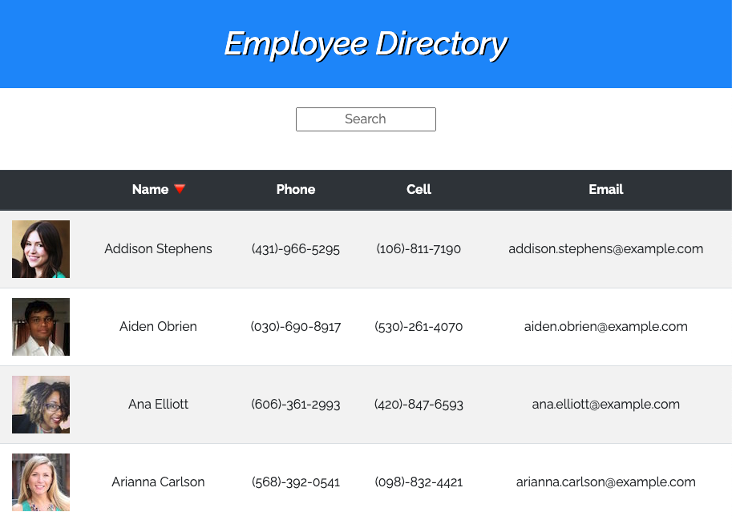
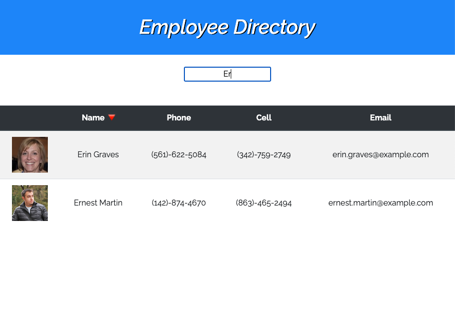

# React-Employee-Directory
An employee directory created with React, with a sortable table by name and a Search-bar user filter.

### Unit 19 - RUT-JER-FSF-PT-06-2020-U-C-TTH
---
## *Table of Contents*
- [Description](#description)
- [User Story](#user-story)
- [Usage](#usage)
- [Contributing](#contributing)
- [Authors](#authors)
- [Screenshots](#screenshots)
- [Contact Me](#contact-me)
- [License](#license)
---
## *Description*
For this assignment, we were required to create a employee directory with React. It required a break up of the application's UI into components, manage component state, and response to user events.

## *User Story*

* As a user, I want to be able to view my entire employee directory at once so that I have quick access to their information.

* An employee or manager would benefit greatly from being able to view non-sensitive data about other employees. It would be particularly helpful to be able to filter employees by name.

* Given a table of random users, when the user loads the page, a table of employees should render. 

* The user should be able to:

  * Sort the table by at least one category

  * Filter the users by at least one property.
## *Usage*
  The deployed application is available at this [GitHub Pages link](https://bwaycarl.github.io/React-Employee-Directory/).

  ## *Authors*
  Carlos Martinez

---
  ## *Screenshots*
  

  
    

 ## *Contact Me*
 - Github: **[BwayCarl](https://github.com/BwayCarl)**
 - LinkedIn: **[Carlos Martinez](https://www.linkedin.com/in/carlos-martinez-8702b146/)** 
 - Twitter: **[@BwayCarlDev](https://twitter.com/BwayDev)**
 - Email: **[bwaycarl@gmail.com](mailto:bwaycarl@gmail.com)**

## *License* 
This project is [MIT](https://github.com/BwayCarl/React-Employee-Directory/blob/main/LICENSE) Licensed.
 
 &copy; 2020, Carlos Martinez